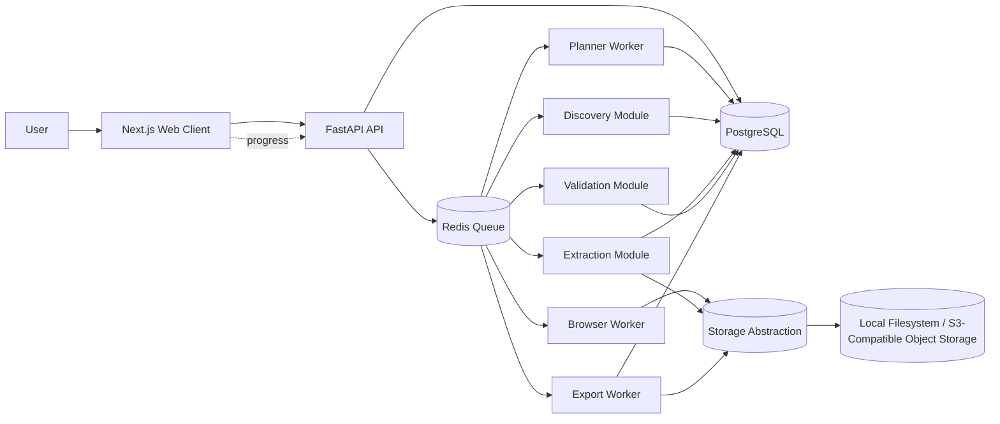
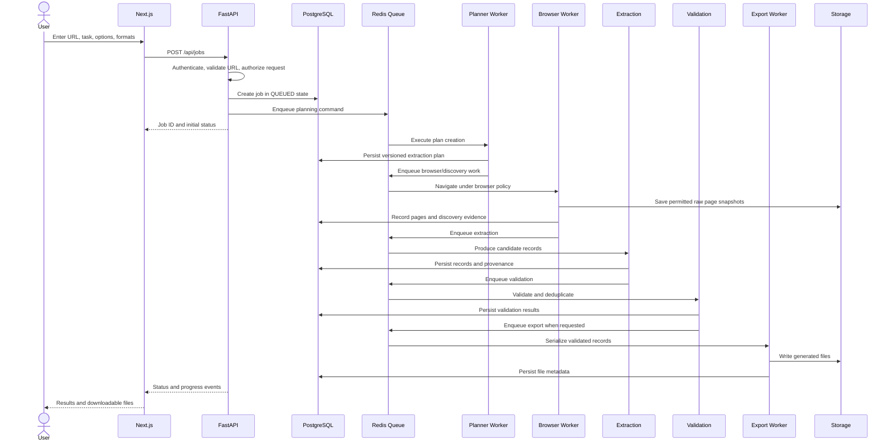

# Phase 0 Architecture

## Status and scope

This document defines the architecture for the **AI Web Data Agent**, a generalized platform that accepts a user-supplied public website URL, a natural-language extraction request, optional constraints, and desired output formats. It establishes contracts and boundaries for later phases; it does not implement the planner, browser agent, discovery engine, extraction engine, validation engine, exporters, frontend, or production deployment.

The platform is intended for web content that the user is permitted to access. It must not bypass CAPTCHA, authentication, authorization, paywalls, access controls, or other security mechanisms.

## Architectural goals

The architecture prioritizes separation of concerns, explicit service boundaries, asynchronous job execution, browser isolation, deterministic data processing, storage abstraction, testability, observability, and security by default. AI orchestration is kept separate from browser automation, and extraction is kept separate from validation and export.

The first production-oriented slice will be a modular monorepo. A single deployable process is acceptable for local development, but modules must communicate through stable contracts so they can be split into workers or services later without rewriting the domain model.

## System context

The web client submits intent and reads job state. The API authenticates and authorizes requests, validates the initial command, creates durable job records, and schedules work. Workers perform bounded asynchronous operations. PostgreSQL stores durable metadata and structured results, while the storage abstraction manages snapshots and generated files. Redis is a transport and coordination layer, not the system of record.

## Logical layers

| Layer | Responsibility | Must not own |
|---|---|---|
| Web client | Request submission, status display, result and file presentation | Browser automation, secrets, extraction rules |
| API | Authentication boundary, request validation, command/query API, job creation, authorization | Long-running crawling or AI execution |
| Orchestration | Job state transitions, retries, cancellation, progress events | Website-specific selectors or export formatting |
| Planner | Convert user intent into a versioned machine-readable extraction plan | Direct browser control or persistence outside contracts |
| Browser | Navigate and capture permitted page state under policy limits | Deciding what the user wants to extract |
| Discovery | Identify relevant pages and traversal candidates | Final record normalization or file generation |
| Extraction | Convert discovered content into typed candidate records | Export file layout or user authorization |
| Validation | Check required fields, values, duplicates, URLs, and confidence | Browser navigation or file serialization |
| Export | Serialize validated records into requested formats | Crawling, extraction, or validation decisions |
| Persistence | Durable metadata, results, events, and references to artifacts | Domain decisions hidden in storage adapters |
| Policy and security | URL, domain, resource, access, and isolation controls | Bypassing access controls |

## Request-to-result flow

## Cross-cutting contracts

Every command carries a `job_id`, `project_id`, `correlation_id`, idempotency key where applicable, and a plan version once planning is complete. Components return typed domain errors rather than leaking library exceptions. All persisted timestamps are UTC. External content is treated as untrusted input and is never allowed to change system instructions or security policy.

The system records provenance from page to extracted field where feasible. A record should be traceable to a source page and extraction-plan version, making validation, debugging, and reprocessing possible without coupling the exporter to browser internals.

## Async and scale strategy

The API remains responsive by scheduling work and returning a job identifier. Work is split into bounded units such as planning, page capture, discovery, extraction, validation, and export. Queue messages are at-least-once, so handlers must be idempotent through stable operation keys and durable state checks. Retries use bounded exponential backoff and classify errors as retryable or terminal.

Browser workers are isolated from API processes and run with explicit timeouts, concurrency limits, domain policies, and cancellation checks. The design permits horizontal scaling by adding workers while keeping PostgreSQL as the source of truth for job state. Redis failure must not silently mark work complete; recovery is driven from durable job state.

## Determinism and AI boundaries

The planner may be probabilistic, but its output is a validated, versioned plan. The plan is the hand-off between AI reasoning and deterministic execution. Browser actions and extraction operations consume that plan and must not reinterpret the user request. Re-running a plan against the same captured snapshot should produce reproducible extraction behavior to the extent practical.

Website-specific selectors, prompts, and heuristics belong in a plan or adapter boundary, not in shared platform code. No component may grant an AI model unrestricted filesystem, network, credential, shell, or database access.

## Phase boundaries

| Phase | Primary deliverable | Explicit non-goal for Phase 0 |
|---|---|---|
| 0 | Architecture, contracts, policies, and repository foundation | Functional product subsystems |
| 1 | Next.js frontend | Backend job execution |
| 2 | FastAPI backend and background jobs | Browser automation implementation |
| 3 | Async Playwright browser engine | AI planning |
| 4 | Planner agent and plan validation | Discovery and extraction |
| 5 | Discovery workflow | General export formats |
| 6 | Extraction engine | Production deployment |
| 7 | Validation engine | Unrelated UI expansion |
| 8 | Excel, CSV, and JSON exporters | PDF/DOCX delivery |
| 9 | Progress and results experience | Security hardening completion |
| 10 | PDF, DOCX, Markdown, and TXT exporters | Deployment operations |
| 11 | Security, testing, and operational hardening | New product scope |
| 12 | Deployment and production operations | Skipping earlier contracts |

## Architectural invariants

1. A job has one durable state machine and one current plan version.
2. A browser worker can only act within a policy supplied by the orchestrator.
3. Extraction produces structured data; export only serializes validated data.
4. PostgreSQL stores metadata and state; object storage stores large or generated artifacts.
5. All user-supplied URLs are validated before navigation and revalidated across redirects.
6. Progress is derived from durable events or state transitions and is safe to replay.
7. Every external failure is represented by a stable error code and a safe user message.
8. Phase 0 documents interfaces and contracts but does not implement future-phase engines.
