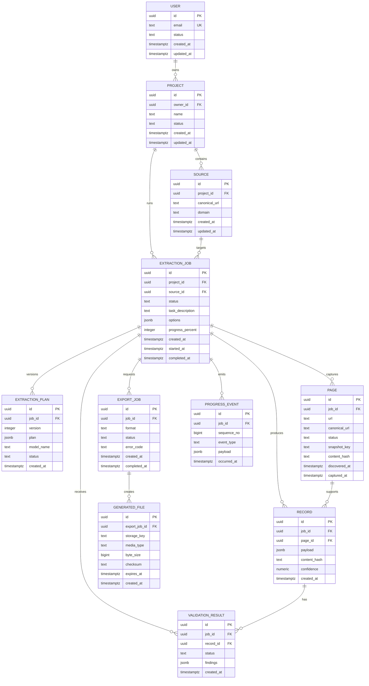

# Data Model

## Modeling principles

PostgreSQL is the source of truth for user-owned metadata, job lifecycle, plan versions, page metadata, structured records, validation findings, progress events, and generated-file metadata. Large page snapshots and file bytes are stored through the storage abstraction and referenced by immutable artifact metadata. All tables use UTC timestamps and explicit ownership relationships.

The model is intentionally limited to entities needed to support the first implementation phases. It avoids storing browser sessions, credentials, or arbitrary model prompts as durable domain data.

## Entity relationship overview

## Entity definitions

| Entity | Purpose | Key constraints and indexes |
|---|---|---|
| `users` | Future authenticated principal | Unique normalized email; index on status; provider subject may be unique when auth is introduced |
| `projects` | User-owned workspace and default policy scope | FK to user; index `(owner_id, updated_at)`; name is unique per owner if product policy requires it |
| `sources` | Canonical starting points and source-domain metadata | FK to project; index `(project_id, domain)`; canonical URL normalized before storage |
| `extraction_jobs` | Durable unit of user work | FKs to project and source; index `(project_id, created_at)` and `(status, created_at)`; idempotency key unique per project where used |
| `extraction_plans` | Versioned machine-readable planner output | Unique `(job_id, version)`; index on `(job_id, created_at)`; plan JSON validated before activation |
| `pages` | Discovered and captured page metadata | FK to job; unique `(job_id, canonical_url)`; index on `(job_id, status)` and content hash; snapshot key is a storage reference |
| `records` | Candidate structured output with provenance | FK to job and optional page; index `(job_id, created_at)` and content hash; payload remains schema-versioned JSONB initially |
| `validation_results` | Findings for a job or record | FK to job and optional record; index `(job_id, status)`; one current result per record and validation version may be enforced |
| `export_jobs` | One requested serialization operation | FK to job; unique `(job_id, format, request_key)`; index `(job_id, status)` |
| `generated_files` | Metadata for downloadable artifacts | FK to export job; unique storage key; index on expiration for cleanup; bytes are not stored in PostgreSQL |
| `progress_events` | Ordered facts for status and realtime clients | Unique `(job_id, sequence_no)`; index `(job_id, occurred_at)` and `(job_id, event_type)` |

## Status enums

Database enums or constrained text values should be introduced with migration discipline. The initial values are:

| Domain | Values |
|---|---|
| User | `ACTIVE`, `SUSPENDED`, `DELETED` |
| Project | `ACTIVE`, `ARCHIVED` |
| Job | `QUEUED`, `PLANNING`, `BROWSER_INITIALIZING`, `DISCOVERING`, `EXTRACTING`, `VALIDATING`, `EXPORTING`, `COMPLETED`, `FAILED`, `CANCELLED` |
| Plan | `DRAFT`, `ACTIVE`, `REJECTED` |
| Page | `DISCOVERED`, `QUEUED`, `CAPTURED`, `SKIPPED`, `FAILED` |
| Validation | `PENDING`, `PASSED`, `PASSED_WITH_WARNINGS`, `FAILED` |
| Export | `QUEUED`, `RUNNING`, `COMPLETED`, `FAILED`, `CANCELLED` |

## Keys, timestamps, and provenance

UUIDs are the external identifier format for jobs and related entities. They are non-sequential and safe to expose without revealing row counts. A separate internal sequence may be used for event ordering, but the public event identity remains a UUID. `created_at` and `updated_at` are required on mutable entities. Jobs, pages, exports, and events also carry stage-specific timestamps where operational timing matters.

A record stores a source page reference, extraction-plan version, content hash, and optional field-level provenance in its payload envelope. A validation result stores the validation rule-set version and findings. These references allow a job to be reprocessed or audited without coupling storage to a particular browser implementation.

## Lifecycle and retention

Creating a job creates its project/source references and an initial `QUEUED` row. Planning adds an immutable plan version, and only one version may be active for a job at a time. Pages and records are retained according to project policy. Generated files have explicit expiration metadata. A cleanup process may remove expired snapshots and files only after checking active references and retention requirements.

Deletion and export of sensitive results must respect ownership and authorization. Hard deletion is not required in Phase 0; a later retention policy may use soft deletion for auditability and a controlled purge workflow for artifacts.

## Transaction boundaries

State transitions, event append, and the durable work-outbox record should be committed atomically where possible. Queue publication can be retried from the outbox. A worker writes its result and the corresponding next-state event in one transaction, then acknowledges the queue message. This prevents a successful operation from being lost between database commit and queue acknowledgement.

## Deliberate omissions

A browser context, cookies, authentication tokens, raw HTML bytes, and model chain-of-thought are not domain entities. Browser contexts are ephemeral and policy-scoped. Raw bytes belong in artifact storage. If future phases need prompt/version audit data, they must store safe metadata and redacted inputs rather than unrestricted sensitive content.
