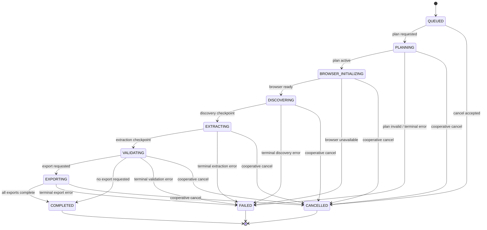

# Job Lifecycle

## Lifecycle contract

An `ExtractionJob` is a durable state machine. Only the orchestrator may perform job-level transitions. Workers report operation outcomes; they do not directly skip stages. Every transition is persisted with an event, timestamp, actor/component, and correlation ID.

## States

| State | Meaning | Entry condition | Exit condition |
|---|---|---|---|
| `QUEUED` | Request accepted and awaiting work | API validation and authorization succeeded | Planning starts or cancellation is accepted |
| `PLANNING` | Machine-readable plan is being created and checked | Planning command claimed | Active plan persisted or terminal failure |
| `BROWSER_INITIALIZING` | Policy-scoped browser context is being prepared | Plan requires page interaction | Browser checkpoint ready or failure/cancellation |
| `DISCOVERING` | Relevant pages and traversal candidates are being found | Browser initialized | Discovery checkpoint satisfies limits or fails |
| `EXTRACTING` | Candidate records are being produced | Pages are available | Extraction checkpoint or failure |
| `VALIDATING` | Records are checked, normalized, and deduplicated | Candidate records available | Validation completed or failure |
| `EXPORTING` | Requested formats are being generated | Validated records and export requests available | All exports complete or failure/cancellation |
| `COMPLETED` | Job reached an allowed terminal success state | Validation complete and exports complete/absent | No transition |
| `FAILED` | Job stopped due to terminal error | Unrecoverable error or exhausted retries | No automatic transition; re-run creates a new job |
| `CANCELLED` | User or policy cancellation completed | Cancellation acknowledged by workers | No transition |

## Transition rules

Transitions are compare-and-set operations against the current version of the job row. An outdated worker cannot overwrite a newer state. A transition must specify an allowed source state, target state, reason, and operation key. Illegal transitions produce an internal `INVALID_STATE_TRANSITION` error and do not emit a public progress event.

A job may move to `FAILED` from any active state for a terminal error. A job may move to `CANCELLED` from `QUEUED` or any active state after the cancellation request is recorded. Completed, failed, and cancelled jobs are immutable except for audit metadata. Reprocessing uses a new job linked to its predecessor rather than mutating terminal history.

## Progress representation

Progress is a projection, not a promise of exact remaining work. Each event may carry a stage, percent estimate, page counters, record counters, and a human-readable safe message. Percent is monotonic within a job and must never be used to authorize a transition. A stage may report `null` or an estimate when the total is unknown, especially during discovery.

Suggested stage weights are configured centrally rather than hardcoded in workers. The API can calculate a weighted projection from completed stage checkpoints, while detailed counts remain available for the UI and diagnostics.

## Retry model

Queue delivery is at least once. Each operation has an operation key, attempt number, maximum attempts, and retryable classification. A retryable error returns the operation to the queue with bounded exponential backoff and jitter. The job remains in its active state while a retry is pending unless the retry budget is exhausted.

Examples of likely retryable failures are temporary network errors, transient browser startup failure, and temporary storage or queue outages. Invalid URL, denied domain, unsupported format, malformed plan after bounded repair, and policy violations are terminal. Retried work must check durable completion markers before creating duplicate pages, records, events, or files.

## Cancellation model

The cancellation endpoint records `cancel_requested_at` and an optional actor. Workers check the flag before each page, browser action, batch, and export chunk. Browser contexts are closed at a safe checkpoint. The orchestrator prevents new child commands and marks the job `CANCELLED` after active operations acknowledge cancellation.

Cancellation is not deletion. Artifacts already created remain subject to retention and authorization policy. A cancelled job may expose partial results only if the product explicitly supports that behavior and the results are clearly marked incomplete.

## Failure handling

The job stores a stable error code, safe message, retryable flag, attempt count, and correlation ID. Detailed stack traces and provider diagnostics remain in protected logs. A worker heartbeat and lease timeout allow recovery of abandoned work. Recovery reconciles durable state and operation markers rather than blindly rerunning every command.

## Idempotency and checkpoints

The orchestrator writes a durable checkpoint after each page batch and stage. A checkpoint includes plan version, input artifact hashes, output counts, and the next cursor or page candidate. Replayed commands compare these values before applying changes. The same source page within a job is identified by canonical URL and content hash where possible.

## Realtime event sequence

Events are appended with a monotonic sequence number per job. The minimum event vocabulary is `job_queued`, `planning_started`, `planning_completed`, `browser_started`, `page_discovered`, `page_scanned`, `records_found`, `validation_completed`, `export_started`, `export_completed`, `job_completed`, `job_failed`, and `job_cancelled`. An SSE client may reconnect with the last event ID and receive retained events in order.
