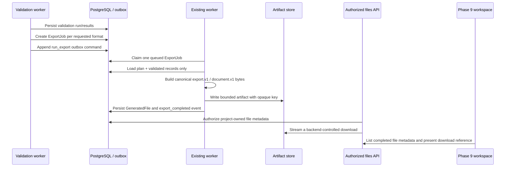

# Phase 10R — Durable Export Lifecycle Repair

## Root cause

Phases 8 and 10 supplied canonical dataset builders and pure tabular/document renderers, while the durable model already contained `ExportJob` and `GeneratedFile`. The missing integration was the validation-to-export handoff: no export command was persisted in the transactional outbox, the worker had no export handler, generated-file metadata was never saved, and the files API deliberately returned an empty list. Consequently, a requested format could be rendered in isolation but could not become an authorized artifact.

## Repaired architecture

The repair uses the existing `ExtractionJob`, `ValidationRun`, `ExportJob`, `GeneratedFile`, `WorkOutbox`, `JobService`, worker, and `LocalArtifactStore` boundaries. It creates no second job system, worker, storage adapter, result API, dataset, browser action, extraction action, validation action, or model call.

## Command and worker lifecycle

Validation completion transitions the job to `EXPORTING`, creates one `ExportJob` for each requested format, and appends one `run_export` outbox command with the job, project, correlation, validation-run, export-job, operation key, and attempt. The unique export request key is derived from the validation run and immutable export options; the database uniqueness constraint also includes format.

The worker claims only a queued export. It checks durable cancellation before dataset loading and again before storage. It loads the current canonical plan plus `Record`/`ValidationResult` rows for the completed validation run, builds the existing canonical dataset, selects the existing writer registry, and uses the existing `document.v1` adapter for PDF, DOCX, Markdown, TXT, and HTML. No raw website data is read. The artifact store enforces the server-owned byte ceiling, and the worker persists the resulting opaque key, checksum, MIME type, byte size, expiry, and server-generated filename in `GeneratedFile` only after a successful write.

| Outcome | Durable behavior |
| --- | --- |
| Completed export | `ExportJob` becomes `COMPLETED`, `GeneratedFile` is inserted, `export_completed` is appended, and the extraction job becomes `COMPLETED` only when every requested export is complete. |
| Deterministic failure | Unsupported formats, oversized datasets/output, and renderer failures become terminal export failures. |
| Infrastructure failure | Storage/worker infrastructure failures use the existing bounded retry mechanism and `export_retry_scheduled` event. |
| Cancellation | A cancelled job does not claim or finalize an export. Existing completed artifacts remain isolated by authorization. |
| Interrupted worker | Expired export leases requeue the same export operation with a fresh attempt key; a completed export is never re-rendered. |

## Supported formats and storage MIME types

| Format | Writer path | MIME type |
| --- | --- | --- |
| XLSX | Existing `XlsxExporter` | `application/vnd.openxmlformats-officedocument.spreadsheetml.sheet` |
| CSV | Existing `CsvExporter` | `text/csv` |
| JSON | Existing `JsonExporter` | `application/json` |
| PDF | `DocumentExporter` → existing PDF renderer | `application/pdf` |
| DOCX | `DocumentExporter` → existing DOCX renderer | `application/vnd.openxmlformats-officedocument.wordprocessingml.document` |
| Markdown | `DocumentExporter` → existing Markdown renderer | `text/markdown` |
| TXT | `DocumentExporter` → existing TXT renderer | `text/plain` |
| HTML | `DocumentExporter` → existing escaped HTML renderer | `text/html` |

## File retrieval and Phase 9 recognition

`GET /api/jobs/{job_id}/files` now joins only completed export jobs belonging to the authorized job owner and returns safe file metadata: UUID, format, server-generated filename, MIME type, byte size, checksum, expiry, and a backend-controlled download route. Storage keys and filesystem paths remain private. `GET /api/files/{file_id}/download` repeats the owner join before streaming the opaque stored artifact. Unknown or cross-project file IDs receive the same safe `NOT_FOUND` result.

The existing Phase 9 client preserves all selected supported formats, treats `EXPORTING` as an active stage, fetches authorized file metadata once the job is completed, and presents a small generated-artifacts list. It does not redesign Data Loom or create another result API.

## Limits, testing, and known limitations

The worker owns record, output-byte, timeout, concurrency, and retry ceilings through the `EXPORT_*` settings. Rendering is bounded and does not execute source values, templates, scripts, paths, or commands. Focused tests cover every format from durable command through worker/storage/file metadata, real worker execution, idempotent redelivery, cancellation, terminal serialization/limit errors, expired-lease recovery, allowed MIME types, API list/download behavior, and cross-user denial. Existing Phase 8 writers and Phase 10 document tests remain regression coverage.

The local development adapter streams authorized files from local storage. It is not an external object-store/signed-link deployment implementation. The repair does not add user-selected export options beyond the existing immutable default policy, bulk export-management screens, retention workers, production credentials, deployment infrastructure, or Phase 11 security hardening.

> **Phase 11 and Phase 12 are not started by this repair.** The next allowed action after a successful Phase 10R delivery is the mandatory Phase 11 preflight.
