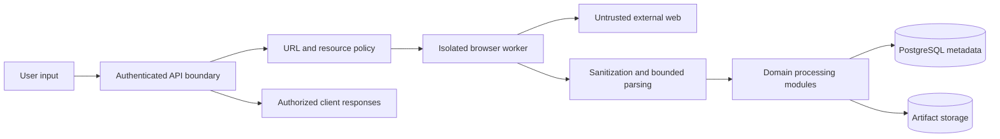

# Security Boundaries

## Scope

Phase 0 defines security boundaries and required controls. It does not implement the complete security layer. The platform handles user-supplied URLs and untrusted web content, so security decisions must occur before browser navigation, at every redirect, and at every artifact or result boundary.

The product boundary is public, permitted content. The system must not bypass CAPTCHA, authentication, authorization, paywalls, access controls, or anti-security mechanisms. A site that requires unavailable permission is a safe stop, not a challenge to defeat.

## Trust zones

User input, page content, model output, and extracted values are untrusted. The API, policy layer, storage adapter, and worker runtime are trusted application components with distinct privileges. No untrusted input may redefine system policy or become executable configuration without validation.

## SSRF and URL controls

SSRF is a primary threat because the user supplies arbitrary URLs and redirects can change the destination after initial validation. Phase 11 must implement defense in depth:

1. Accept only `http` and `https`; reject credentials in URLs, fragments where inappropriate, alternate numeric IP encodings, unsupported schemes, and malformed hostnames.
2. Canonicalize hostnames and URLs consistently before allowlist comparison and logging.
3. Resolve DNS and reject loopback, private, link-local, multicast, carrier-grade NAT, documentation, metadata-service, Unix-socket, and other reserved ranges according to the deployment network policy.
4. Revalidate the resolved destination after redirects and before connection, and mitigate DNS rebinding by controlling resolution and connection behavior.
5. Apply an explicit allowed-domain policy. A user request does not grant access to internal or unrelated domains.
6. Restrict outbound ports and protocols at the network layer where possible, and run browser workers in a network sandbox with egress controls.
7. Prevent navigation to `file:`, `data:`, `javascript:`, `blob:` where unsafe, local admin endpoints, cloud metadata endpoints, and internal control-plane services.

The API should return a generic safe denial such as `DOMAIN_NOT_ALLOWED` or `INVALID_URL`; it should not reveal private address details or internal topology.

## Resource-exhaustion controls

The system must cap navigation time, page count, crawl depth, records, redirects, response size, total bytes, browser duration, concurrent pages, queue work, export size, and retained artifacts. Rate limiting applies per user, project, domain, and service. Limits are enforced in the orchestrator and worker, with the worker failing closed if policy is missing.

Parsing must be bounded. HTML, JSON, images, PDFs, and other content are subject to media-type, byte-size, and processing-time limits. Zip-bomb-like archives, decompression expansion, pathological selectors, and oversized AI inputs must be rejected or truncated with explicit diagnostics.

## Browser and process isolation

Browser workers run separately from the API and should use per-job contexts, restricted permissions, ephemeral profiles, disabled downloads by default, and minimal filesystem access. Containers or equivalent sandboxing should limit CPU, memory, process creation, network egress, and filesystem visibility. Worker identities receive only the database and storage permissions required for their operation.

A browser worker must not receive application credentials, arbitrary shell access, or unrestricted database access. Cookies and local storage are scoped to a job and never shared across users or projects.

## Authentication and authorization

The future API requires authentication for project and job operations. Authorization is checked server-side for every create, read, cancel, result, event, and file request. Project ownership and membership are the primary scope; job identifiers alone never grant access. Service-to-service credentials use short-lived, least-privilege identities and are kept in a managed secret store or deployment secret mechanism.

Phase 0 uses an authentication placeholder only. It does not introduce login, identity providers, or credential handling.

## Secrets and sensitive data

Secrets must be supplied through environment or managed secret injection and never committed, logged, embedded in prompts, or returned through results. `.env.example` contains names and comments only. Logs redact authorization headers, cookies, tokens, connection strings, and secret-like values.

Raw page snapshots and generated exports may contain personal or commercially sensitive data. Access is authorized, artifacts use short-lived download links, storage keys are unguessable, encryption is enabled where available, and retention/expiry is explicit. The product should document whether user data is used for model training; absent an explicit policy, it must not be assumed.

## AI safety boundary

Planner output is untrusted until schema validation, policy validation, and resource-budget validation succeed. Models cannot choose arbitrary domains, tools, filesystem paths, shell commands, credentials, SQL, or network destinations. Page content is data and must be separated from system instructions. Human-readable explanations are not treated as executable actions.

Plan repair, if introduced later, is bounded by a deterministic schema and a fixed action vocabulary. Repeated invalid plans fail safely rather than expanding permissions.

## Logging and incident response

Structured logs include job and correlation IDs, component, operation, duration, outcome, policy decision, and stable error code. Logs exclude secrets and unrestricted page content. Security-relevant decisions such as denied domain, blocked private IP, exceeded limit, rejected redirect, and unauthorized artifact access are auditable with safe metadata.

Phase 11 should add dependency scanning, container hardening, secret scanning, threat-model review, SSRF regression tests, authorization tests, and an incident response procedure. It should also define data deletion, retention, and access-review workflows.

## Security non-goals for Phase 0

No CAPTCHA solver, anti-bot evasion system, credential theft, paywall bypass, authentication bypass, stealth browser, production secret manager, full authorization provider, or complete network sandbox is implemented in this phase. The documents establish their required boundaries for later implementation.
