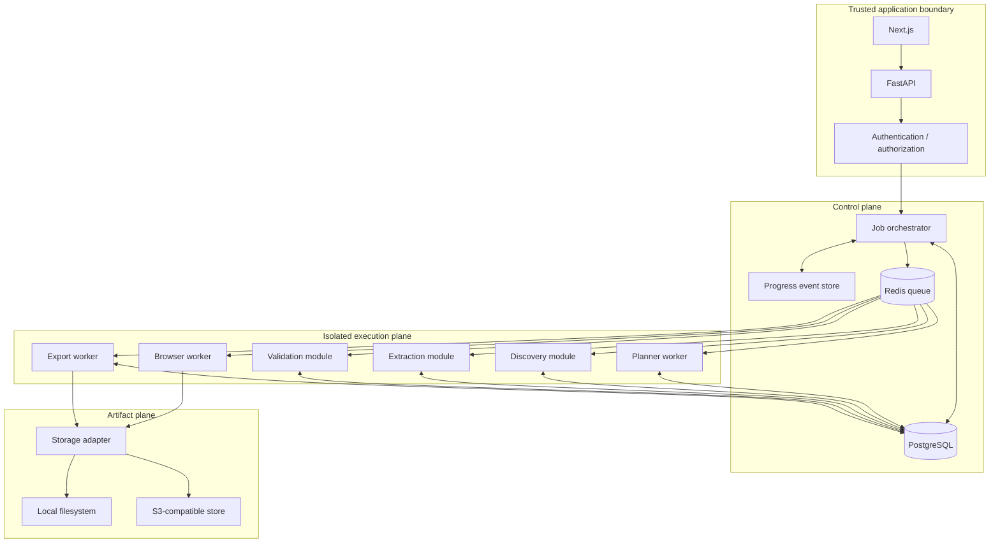

# System Design

## Design intent

The system is a job-oriented platform rather than a request/response scraper or a chatbot. A user request becomes a durable `ExtractionJob`, which is planned, executed under policy, validated, and optionally exported. Each stage has a narrow responsibility and communicates through versioned domain contracts.

## Component responsibilities

| Component | Inputs | Outputs | Reliability responsibility |
|---|---|---|---|
| Next.js web client | User URL, task, options, requested formats | API commands, progress view | Never exposes service secrets or performs privileged navigation |
| FastAPI API | Authenticated HTTP requests | Job commands, status and result queries | Validate requests, authorize access, return safe errors |
| Job orchestrator | Durable job state and commands | State transitions, queue messages, progress events | Enforce legal transitions, idempotency, retry policy, cancellation |
| Planner worker | User intent and constraints | Versioned extraction plan | Produce schema-valid output; record model and prompt metadata safely |
| Browser worker | Navigation work and browser policy | Page snapshots, page metadata, evidence | Isolate browser, enforce limits, capture permitted state |
| Discovery module | Captured pages and plan | Page candidates and traversal decisions | Avoid unbounded crawling; retain evidence for decisions |
| Extraction module | Page content and plan | Candidate records with provenance | Prefer deterministic transformations; isolate site adapters |
| Validation module | Candidate records and requirements | Validated records and validation findings | Report missing, malformed, duplicate, and low-confidence data |
| Export worker | Validated records and format request | Generated file artifact metadata | Keep serialization independent from extraction and validation |
| PostgreSQL | Domain commands and results | Durable state and query projections | Source of truth for lifecycle, metadata, and structured results |
| Redis queue | Work messages | Delivery to workers | At-least-once delivery; never sole source of truth |
| Storage adapter | Snapshot and file bytes | Artifact references | Hide local/S3 implementation details and enforce size/content policy |

## Deployment topology

Local development may run API, worker processes, PostgreSQL, Redis, and local object storage through Docker Compose. Production may split workers by workload and scale them independently. The logical boundaries remain the same whether modules share a process or are deployed as separate services.

## Commands and events

Commands request work and are processed at least once. Examples include `CreateJob`, `CreatePlan`, `CapturePage`, `DiscoverPages`, `ExtractRecords`, `ValidateRecords`, and `GenerateExport`. Commands include a stable operation key so a retry can safely find an existing result.

Events describe facts that have happened, such as `JobQueued`, `PlanningCompleted`, `PageDiscovered`, `RecordsFound`, `ValidationCompleted`, `ExportCompleted`, or `JobFailed`. Events are append-oriented and carry a sequence number per job. The API can build a progress projection from the event stream without exposing internal queue details.

## Retry and cancellation policy

Transient network failures, queue interruptions, and selected provider failures may be retried with bounded exponential backoff and jitter. Invalid URLs, denied domains, unsupported formats, policy violations, and schema-invalid plans are terminal unless a user changes the request. Retry counts and the last safe error are persisted on the job or operation.

Cancellation is cooperative. The API records a cancellation request, workers check it between browser actions and processing units, and the orchestrator transitions the job to `CANCELLED` only after in-flight work has stopped or reached a safe checkpoint. A cancelled job must not start new child work or create new exports.

## Storage design

The storage abstraction exposes typed operations for raw page snapshots, structured records when payload size warrants object storage, generated exports, and temporary files. It returns immutable artifact references containing a storage key, media type, byte size, checksum, and expiration policy. Extraction code depends on the interface, never on filesystem paths or S3 SDKs.

PostgreSQL retains metadata, searchable results, lifecycle state, and provenance. Large snapshots and generated files use the storage adapter. Local filesystem storage is the development implementation; an S3-compatible implementation is a later deployment choice. Cleanup jobs remove expired temporary artifacts only after checking references and retention policy.

## Error model

All user-visible failures have a stable code, safe message, retryability classification, and correlation ID. Internal logs may contain diagnostic context but must not contain credentials, cookies, authorization headers, or raw sensitive output. The canonical codes are documented in [API Contracts](api-contracts.md) and may include `INVALID_URL`, `DOMAIN_NOT_ALLOWED`, `BROWSER_TIMEOUT`, `PAGE_LOAD_FAILED`, `DISCOVERY_FAILED`, `EXTRACTION_FAILED`, `VALIDATION_FAILED`, `EXPORT_FAILED`, `JOB_CANCELLED`, and `RESOURCE_LIMIT_EXCEEDED`.

## Observability baseline

Phase 0 requires conventions rather than a monitoring stack. Every request, command, worker action, and event carries `job_id` when available and a `correlation_id` for cross-component tracing. Structured logs use stable event names and fields such as component, operation, duration, attempt, outcome, error code, and policy decision.

Initial metrics should include jobs created and completed, time spent per lifecycle stage, queue wait time, page load failures, pages discovered, records produced, validation failure counts, export duration, artifact size, retry counts, and cancellation counts. Browser diagnostics should capture sanitized URL, navigation timing, and failure category rather than unrestricted page content.

## Testing strategy for later phases

Contract tests verify API schemas, event payloads, and storage adapters. Unit tests cover state transitions, URL policy, plan validation, deterministic transformations, validation rules, and exporter output. Integration tests run API, queue, database, and local storage together. Browser tests use controlled fixtures and permitted public test targets; they must not rely on bypassing access controls. Property and fuzz tests are appropriate for URL parsing, limits, and malformed extracted data.

## Future-phase boundaries

Phase 0 establishes this design only. Phase 1 may build the client against the documented API. Phase 2 may implement the API and queue-backed jobs. Phase 3 may implement browser workers. Planner, discovery, extraction, validation, exporters, progress UI, security hardening, and deployment remain in their assigned roadmap phases.
